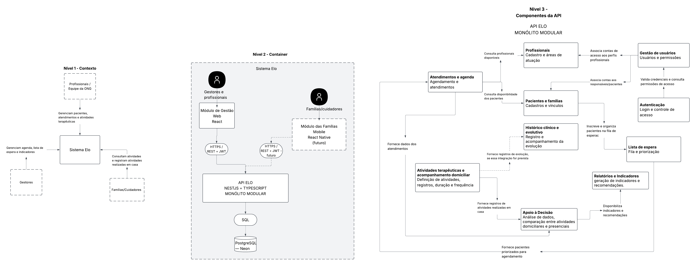

# Diagrama C4 — Projeto Elo

O Diagrama C4 apresenta a arquitetura do Sistema Elo — Gestão Inteligente Integrada, uma plataforma desenvolvida para apoiar a gestão da ONG Palavra em Ação e o acompanhamento do desenvolvimento de crianças e adolescentes.

O sistema é composto por um módulo de gestão web, uma API responsável pelas regras de negócio e pela comunicação com o banco de dados, e um módulo mobile destinado às famílias, previsto para implementação futura.

**Arquivo editável:** [Abrir diagrama C4](https://lucid.app/lucidchart/cd3b9540-37e4-40f0-9c48-160285050df0/edit?viewport_loc=-228%2C-775%2C4369%2C2308%2C0_0&invitationId=inv_0200da29-fc57-432e-83a1-92c9b48842ea)

## Nível 1 — Contexto

O diagrama de contexto apresenta o Sistema Elo e os principais atores que interagem com ele: gestores, profissionais da ONG e famílias/cuidadores conforme o escopo de utilização definido para a plataforma.

Os gestores utilizam o sistema para apoiar a gestão da instituição, incluindo a agenda e a lista de espera. Os profissionais realizam atividades relacionadas aos pacientes, atendimentos e acompanhamento terapêutico. As famílias/cuidadores participam do acompanhamento domiciliar por meio do acesso às atividades e do registro de sua realização.

## Nível 2 — Containers

O diagrama de containers apresenta os principais elementos tecnológicos do Sistema Elo:

- **Módulo de Gestão Web:** desenvolvido em React, oferece as funcionalidades de gestão da instituição.
- **API Elo:** desenvolvida em NestJS e TypeScript, utiliza a arquitetura de monólito modular em camadas e centraliza as regras de negócio e o acesso aos dados.
- **Banco de dados:** PostgreSQL, hospedado no Neon, responsável pela persistência das informações do sistema.
- **Módulo das Famílias Mobile:** previsto para desenvolvimento futuro, será implementado em React Native e permitirá o acompanhamento das atividades realizadas em casa.

O módulo web e o futuro aplicativo mobile se comunicam com a API por meio de HTTP/REST, utilizando HTTPS e JWT para a comunicação e autenticação. O acesso ao banco de dados é realizado pela API, por meio de SQL.

## Nível 3 — Componentes da API

O diagrama de componentes detalha a organização lógica interna da API Elo, agrupando as responsabilidades do sistema em componentes relacionados aos principais domínios de negócio.

Entre as responsabilidades representadas estão a autenticação e a gestão de usuários, profissionais, pacientes, atendimentos, agenda, lista de espera, atividades terapêuticas, acompanhamento domiciliar, histórico clínico e evolutivo e apoio à decisão.

Esses componentes fazem parte de uma única API, organizada conforme a arquitetura de monólito modular, e colaboram entre si para disponibilizar as funcionalidades do sistema. O componente de apoio à decisão utiliza informações relevantes para contribuir com a geração de indicadores, relatórios e recomendações, incluindo a comparação entre atividades domiciliares e presenciais.